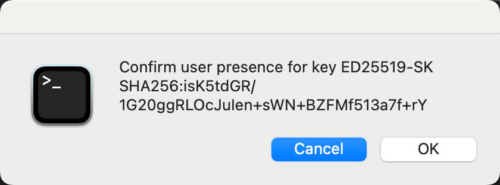

ssh-askpass
===========

ssh-askpass for OS X/macOS. Works in 10.7+ (Lion). Tested in 10.14(Sonoma)

Used to accept (or deny) the use of the private key(s) added to the SSH authentication agent with `ssh-add`.

Also used for user presence verification when using FIDO2 security keys with OpenSSH.




**If you’re having trouble with ssh-askpass after OS upgrade, please follow the installation steps again.**

## Installation

### [Homebrew](https://brew.sh/)
```
$ brew install vdr/tap/ssh-askpass
```

## Enabling keyboard navigation
For security reasons ssh-askpass defaults to cancel since it's too easy to
press spacebar and accept a connection or other actions which might use
ssh-keys. To make it easier to press `OK`:

* Go to `System Preferences` and then `Keyboard`.

#### Pre 10.11
* Under the `Keyboard` tab, click on `All controls`.

#### 10.11-10.14
* Under the `Shortcuts` tab, click on `All controls`.

#### 10.15+
* At the bottom of the `Shortcuts` tab, check option `Use keyboard navigation to move focus between controls`.

Now you can press ⇥+spacebar to press `OK`.

## License
ISC license

## Contributors
* [theseal](https://github.com/theseal)
* [simmel](https://github.com/simmel)
